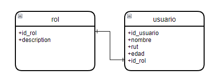
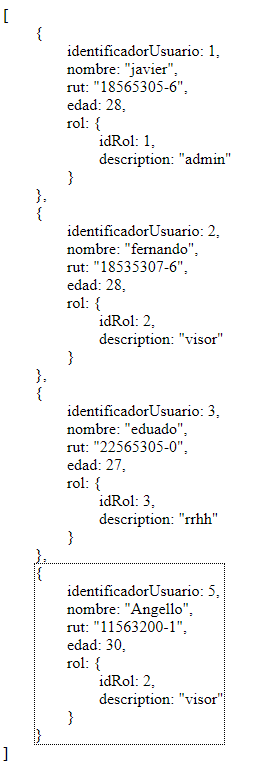

## Spring-Boot Mysql Example

-----
## versions

| Tecnology            | version |
|----------------------|---------|
| Java                 | 11      |
| Spring-Boot          | 2.6.6   |
| Lombook              | 18.22   | 
| jaxb-api             | 2.3.6   |
| jaxb-runtime         | 2.3.6   |
| mysql-connector-java | 8.0.28  |

-----
## Base de datos

db/dump-spring-mysql-202204081019.sql

#[Guia]

* 1 - Aplicaciones Monoliticas vs Aplicaciones Microservicios
* 2 - Estructura proyecto Spring Boot.
* 3 - Explicar Capa Config
* 4 - Explicar Capa Controller
* 5 - Explicar Capa Dto
* 6 - Explicar Capa Exception
* 7 - Explicar Modelo/Dao
* 8 - Explicar security
* 9 - Explicar service
* 10 - Explicar util 
* 11 - Ejemplo dao
* 12 - Ejemplo CRUD

# Request Mapping

http://localhost:8080/usuario

Javier DEV ©